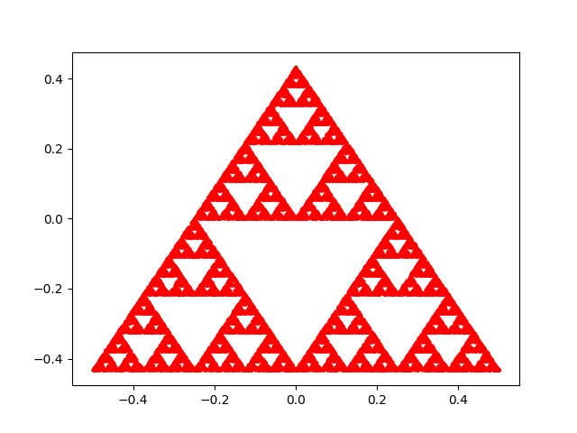

# Sapinski triangles : 
The folling code generates [_Sapinski Triangles_](https://en.wikipedia.org/wiki/Sierpiński_triangle "Sapinski Triangles") using the following operation as many times as the user desires : 

1.**Choose a random point inside the surface of an equilateral triangle :**
This step for the moment fixed by choosing the median point of one of the triangle's sides ;

2.**Consider the last added point,  choose one of the triangle's extremities randomly, then plot their median;**

Repeating the last operation enough times will give a good outline of the _Sapinski Triangles_.

